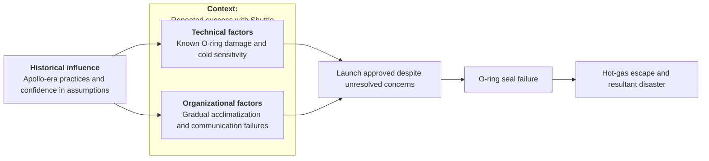

# Causal-flowchart

```mermaid
flowchart LR
    H["<b>Historical influence</b><br/>Apollo-era practices and confidence in assumptions"]

    subgraph S["<div style='text-align:center'><b>Context:</b><br/>Repeated success with Shuttle<br/>missions reinforced confidence</div>"]
        direction TB
        T["<b>Technical factors</b><br/>Known O-ring damage and cold sensitivity"]
        O["<b>Organizational factors</b><br/>Gradual acclimatization and communication failures"]
    end

    H --> T
    H --> O

    T --> D["Launch approved despite unresolved concerns"]
    O --> D

    D --> F["O-ring seal failure"]
    F --> L["Hot-gas escape and resultant disaster"]
```